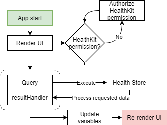
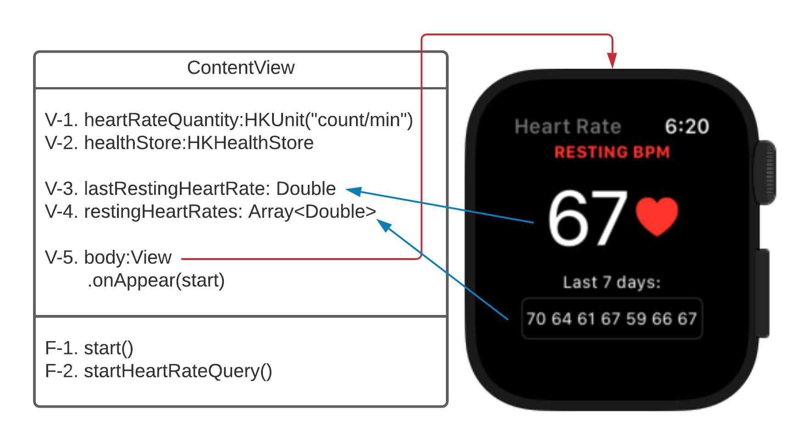

# Resting-Heart-Rate-App
Simple application for retrieving and displaying a users resting heart rate. Implemented for Apple Watch, functionality wise should work identically on all Apple devices.

# Flow

The heart rate app flow is simple, where most of the flow describes how health data is retrieved from the HealthKit Store using queries. First, to use the HealthKit framework, the app must check for permission from the user. If permission is given, the app can then execute a query in the HealthKit store. The store then returns the requested data in the query's result handler, where the stored variables are updated to the new fetched ones. The user interface then updates the screen values because they have changed. The flow is identical to both versions of this app, where the only difference is what query is used.

# Class diagram

ContentView is not a class but a structure. In swift, the major difference between structs and classes is that structs do not support inheritance, typecasting and deinitializers. The ContentView struct is the main view responsible for initializing the content and layout in the user interface. For this task, the two needed functions are created as nested-function inside the ContentView for simplicity.
    
    - [V-1] Constant used in the query to specify the quantity type returned.
    - [V-2] Access point to the HealthKit store. Used to dispatch queries.
    - [V-3] Variable to store the last resting heart rate.
    - [V-4] List variable used to store the last seven days' resting heart rates.
    - [V-5] View body of the app. This is where the interface is implemented. The blue arrow lines indicate text components in the interface using the appointed values. The onAppear(start) action calls the \textbf{F-1} (start) function upon the appearance of the view. Here used as a simple way of initializing the application.
    - [F-1] Start function. Calls for authorization of HealthKit and calls \textbf{F-2} when the user gives permission.
    - [F-2] Start heart rate query function. It is very similar to Listing \ref{listing:statistical_collection_query} and includes a statistics update handler allowing the application to keep receiving updates from the HealthKit store every time a value in the scope is updated or added. The function initializes a statistics collection query with initial results and statistics update handlers which updates \textbf{V-3} and \textbf{V-4}, then dispatches the query with \textbf{V-2} (the HealthKit store).
